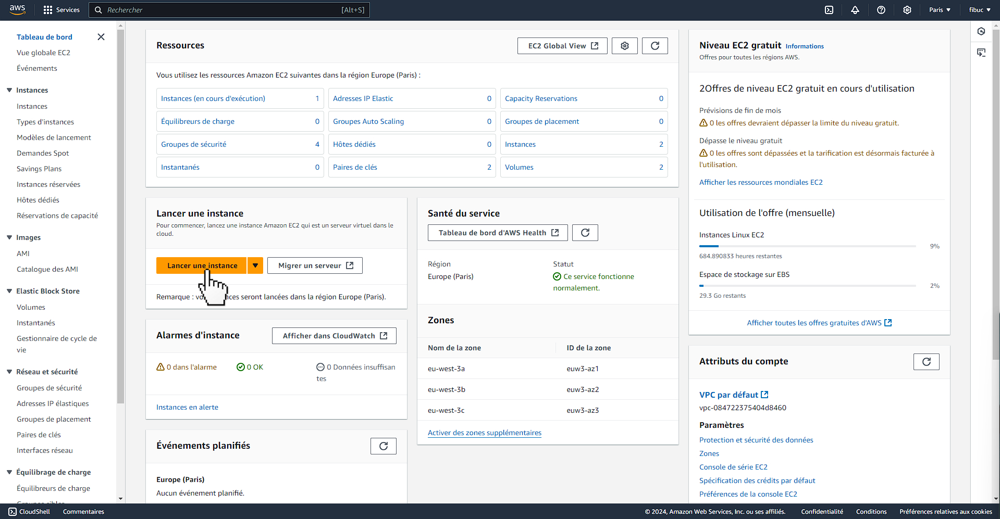
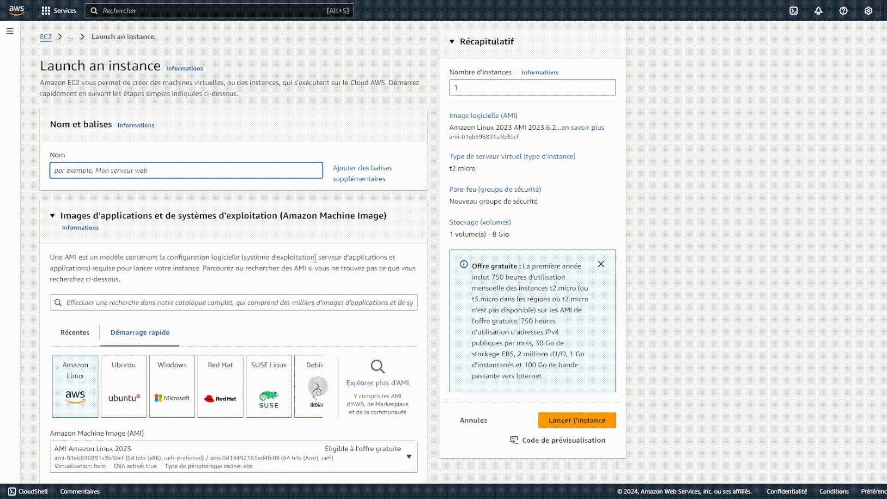

Configurer une instance AWS
===========================

Création d'un compte AWS
------------------------

Pour créer un compte sur AWS, rendez-vous sur le site `Amazon AWS <https://aws.amazon.com/fr/ec2/>`_

Créer une instance AWS
----------------------

- Une fois le compte créé, retournez sur le site EC2 et cliquez sur ``Lancer une instance``

- Mettez le nom de votre instance et laissez ``Amazon Linux`` en système d'exploitation.

- Créez une paire de clés

.. image:: _static/img/aws_keys_instance.gif
   :align: center
   :width: 90%

- Maintenant, il faut modifier les paramètres réseau de l'instance pour y inclure le protocole ``HTTP`` puis lancez l'instance.

.. image:: _static/img/aws_network_instance.gif
   :align: center
   :width: 90%

Connexion à l'instance
----------------------

Ensuite, il va falloir se connecter pour la première fois sur l'instance afin de pouvoir installer Docker pour déployer notre projet.

Pour cela, copier l'adresse IP publique de votre instance, puis rendez-vous dans le terminal et tapez la commande suivante :

.. code-block:: bash

   ssh -i path/to/key.pem ec2-user@<ip-publique>

Et saisissez 'yes'.

.. image:: _static/img/aws_connect_ssh.gif
   :align: center
   :width: 90%

Une fois connecté, vous aurez besoin de vérifier les mises à jour.

.. code-block:: bash

   sudo su # Passage en mode administrateur
   yum update -y

Installation de Docker
----------------------

Maintenant, nous avons besoin d'installer Docker sur notre instance. Pour cela, tapez les commandes suivantes :

.. code-block:: bash

   curl -fsSL https://get.docker.com -o get-docker.sh
   yum install docker -y
   docker --version # Vérifie que Docker est bien installé

Voilà, Docker est installé sur notre instance et nous allons le démarrer : 

.. code-block:: bash

   systemctl start docker

Pour vérifier que Docker est bien installé sur l'instance, vous pouvez effectuer :

.. code-block:: bash

   systemctl status docker

   # Résultat attendu
   > ● docker.service - Docker Application Container Engine
     ...
     Active: active (running) since Thu 2024-11-21 00:59:21 UTC; 9s ago
     ...

Voilà, notre instance est bien paramétrée, vous pouvez vous déconnecter.

.. code-block:: bash

   exit
   logout