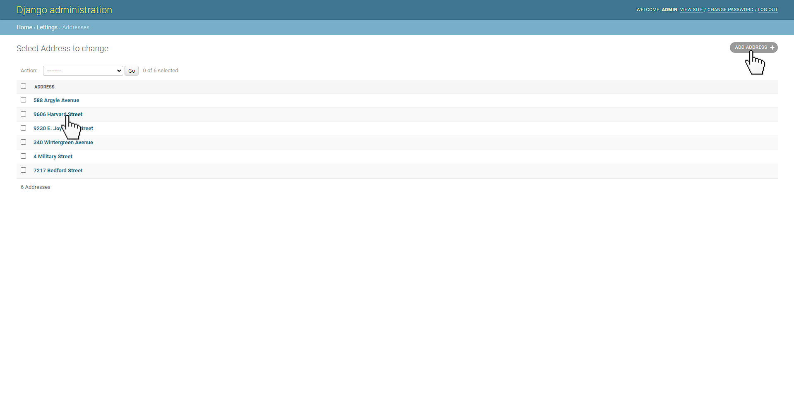

Guide d'utilisation
===================

Accès au site de l'application
------------------------------

Pour accéder au site de l'application, vous pouvez y accéder de deux manières différentes :

Accès via le projet déployé
***************************

Pour cela rendez-vous sur ``http://votre_adresse_ip_publique_EC2/``

Pour l'exemple, `ce lien <http://52.47.99.215/>`_ est disponible pour une instance EC2.

.. important::

   Le protocole ``HTTPS`` n'est pas disponible pour l'accès au site. Le protocole à utiliser doit bien être le protocole ``HTTP``.

Accès localement
****************

Lancez votre serveur via :

.. code-block:: bash

   python manage.py runserver
   # OU
   docker compose up

Et ensuite rendez-vous dans `http://localhost:8000/ <http://localhost:8000/>`_

Accès aux profils
-----------------

Liste des profils
*****************

Pour accéder à la liste des profils, vous pouvez naviguer via l'interface utilisateur :

Ou bien via l'URL directe ``/profiles/``

`Lien des profils <http://52.47.99.215/profiles/>`_

Vous arriverez sur la page de la liste des différents profils.

Détails des profils
*******************

Pour accéder aux détails d'un profil, vous pouvez naviguer via l'interface utilisateur en cliquant sur un des profils disponibles.

Ou bien via l'URL directe ``/profiles/<username>/``

`Lien d'un profil <http://52.47.99.215/profiles/HeadlinesGazer/>`_

Vous arriverez sur la page désirée.

.. image:: _static/img/profiles_details.jpg
   :align: center
   :width: 70%

Accès aux locations
-------------------

Liste des locations
*******************

Pour accéder à la liste des locations, vous pouvez naviguer via l'interface utilisateur :

Ou bien via l'URL directe ``/lettings/``

`Lien des locations <http://52.47.99.215/lettings/>`_

Vous arriverez sur la page de la liste des différentes locations.

.. image:: _static/img/lettings_list.jpg
   :align: center
   :width: 70%

Détails des locations
*********************

Pour accéder aux détails d'une location, vous pouvez naviguer via l'interface utilisateur en cliquant sur une des locations disponibles.

Ou bien via l'URL directe ``/lettings/<letting_id>/``

`Lien d'une location <http://52.47.99.215/lettings/2/>`_

Vous arriverez sur la page désirée.

Revenir à la page principale
----------------------------

Pour revenir à la page principale, vous pouvez soit revenir à la racine ``/`` via l'URL, ou bien vous pouvez naviguer via l'interface utilisateur.

Interface administrateur
------------------------

Pour accéder à l'interface utilisateur, il faut passer obligatoirement via l'URL en tappant ``/admin/``

`Lien de l'interface d'administration <http://52.47.99.215/admin/>`_

Connexion
*********

Vous arriverez à l'interface de connexion :

- Username: ``admin``
- Password: ``Abc1234!``

Une fois connecté, vous accèderez à l'interface.

.. image:: _static/img/admin_interface.jpg
   :align: center
   :width: 70%

Intéraction avec un modèle
**************************

Ajouter
^^^^^^^

Si vous cliquez sur un des modèles, vous pourrez accéder à l'interface d'administration de celui-ci. Prenons l'exemple des adresses.

Vous pourrez alors ajouter une adresses en cliquant sur ``ADD ADDRESS``

Remplissez les champs demandés puis enregistrez en cliquant sur ``SAVE``. Si vous voulez en créer plusieurs, vous pouvez cliquer sur ``Save and add another``.

Modifier ou supprimer
^^^^^^^^^^^^^^^^^^^^^

En cliquant sur une des adresses, vous accèderez à ses informations.

.. image:: _static/img/admin_delete_modify_address.jpg
   :align: center
   :width: 70%

Ici, vous pourrez modifier les informations nécessaires et cliquer sur ``SAVE`` pour enregistrer les modifications.

Sinon, vous pouvez supprimer l'adresse en cliquant sur ``Delete``.
